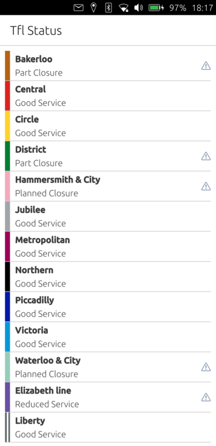
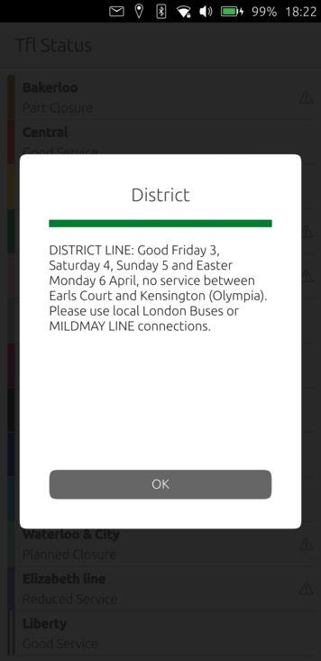

# Tfl Status

Transport For London (Tfl) simple status reports for Ubuntu Touch.

<p float="left">
    
    
</p>

## Build
Install [clickable](https://clickable-ut.dev/en/latest/install.html). Then run it with the device connected to build and install on the device:
```bash
clickable
```

To test on desktop:
```bash
clickable desktop
```
